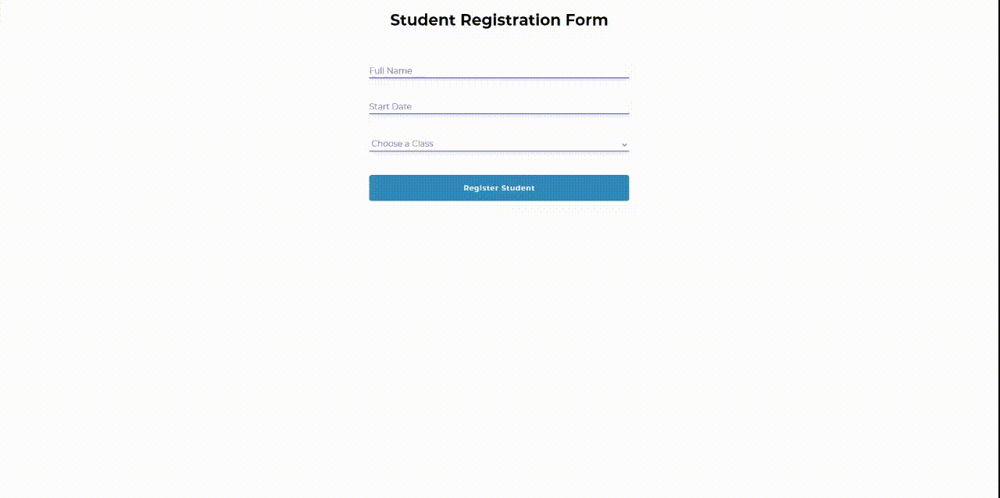

# Student Registration Form

This application allows user to enroll students in classes:
Application consists of a from with three fields(Full name, DOB and Class) and a table 
where the submitted information about students is displayed in rows.
It is also possible to delete student data from the table in case wrong information 
has been added

# Technologies Used:
    * React Js
        * Functional components
        * Formik 
        * Yup validation
        * react-datepicker
        * uuid
        * styled-components

Formik was used in order to simplify the code, make it more readable
and take advantage of the inbuilt components and render props for handling
state and error messages

Yup Object Schema validator makes the code handling custom validation simple and pairs very well with Formik

uuid was used to assign unique id's to student's data for the purposes of the delete function

The purpose of using 'styled-components' was to write CSS that's scoped to a single reusable component and does not overlap with any other component. 

# How to run the project?

Download the repository, open in the editor and in terminal enter

    - npm install
    
 to install all the necessery node modules

After that enter 

    - npm start

to run the application

# Structure of the project

Small, singular items such as - buttons, inputs, select, h1, error message - are in the folder 

- atoms

Example of reusable component made with styled-components Button.js:

        export const  Button = styled.button
        border: none;
        outline: none;
        width: 100%;
        height: 35px;
        border-radius: 5px;
        color: white;
        padding: 0px 10px;
        font-weight: 600;
        letter-spacing: 0.1em;
        cursor:pointer;

        ${props => props.register && css`
        background: #2983bc;
        height:50px
        `}
        ${props => props.delete && css`
            background: #bc2929;
            @media(max-width:340px){font-size:9px}
        }
    
Now a component Button can be imported in any file and styling can be be adjusted by passing props. 
In this case there are two : register and delete
For Example : 

    <Button register></Button>

*The only exception is the Select tag which was not made as a seperate syled component as it broke the functionality when created, could not solve the bug in time, therefore for the time being the styling for select tag is in the App.css

Files regarding form and table components are in the dedicated folders by the same name.

After that one level higher is the StudentList.Js file in the maincontent folder where data from the form is passed down and displayed in the Table. 

